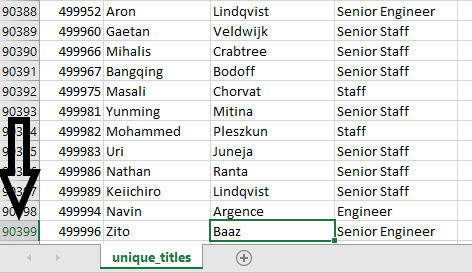
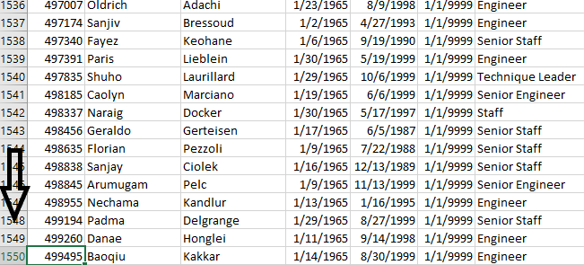

# Pewlett-Hackard-Analysis

## Overview
For this project, we were tasked with performing employee research on a ficticious company called "Pewlett Hackard" with the goal of finding out who will be retiring in the next few years and how many positions will need to be filled.  The purpose of this analysis was use existing .csv files to create an employee database with SQL and then write queiries to filter the data to determine just how massive the "silver tsunami" is going to be at Pewlett Hackard.

## Results
For the purpose of this analysis, we determined that the employees who would be retring soon were employees with birthdates between 1952-1955 and who were still currently employed with the company.  One of the first things we wanted to gather data on for Pewlett Hackard was the first and last name of the employees who have birthdays between 1952-1955 as well as their employee number and title.  Because some employees have had multiple titles during their careers at Pewlett Hackard we needed to further filter this data so that each employee only appears on the list one time which is in respect to their current title.  To help manage the the large number of employees who will be retiring soon, Pewlett Hackard is considering a program to retain a number of the retiring employees as mentors to help ease the transition that will be caused by the "silver tsunami". 

(Image 1) 

(Image 2)

(Image 3)

The following data was collected from our analysis:
- There are over 90,000 employees who are likely to be retiring from Hewlett Packard in the next few years (Image 1).
- There are over 29,000 employees with the title of "Senior Engineer" who will be retiring in the next few years (Image 2).
- There are over 1,500 employees who are eligible for mentorship to help with transition during the "silver tsunami" (Image 3).
- There are only two manager positions that will need to be replaced due to retirement in the next few years (Image 2).
## Summary
Hewlett Packard realizes that a large portion of their workforce is comprised of "baby-boomers" who are approaching retirement age, which is being referred to around the company as the "silver tusnami".  Hewlett Packard has determined that any of their employees born between 1952-1955 will be considered part of the "silver tsunami" of retiring employees.  When we queried the data to find all employees who fit that distinction, we found that there are a total of 90,398 roles that will need to be filled as an effect of the "silver tsunami" (Image 1).  Furthermore, we know that there are 1,549 qualified, retirement-ready employees (Image 3) to mentor the next generatoin of Pewlett Hackard employees.  That means that there is one mentor for every 58 new employees who would need mentoring.  I would be very concerned about the success rate of the mentor program operating at a ratio of 58 mentees to 1 mentor.  While the mentorship program could be used to help ease the transition of the "silver tsunami", I believe additional strategies will need to be implemented in order to facilitate this transition as smoothly as possible.